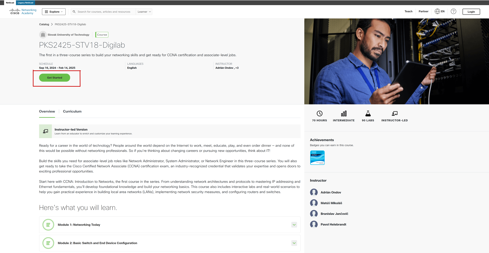
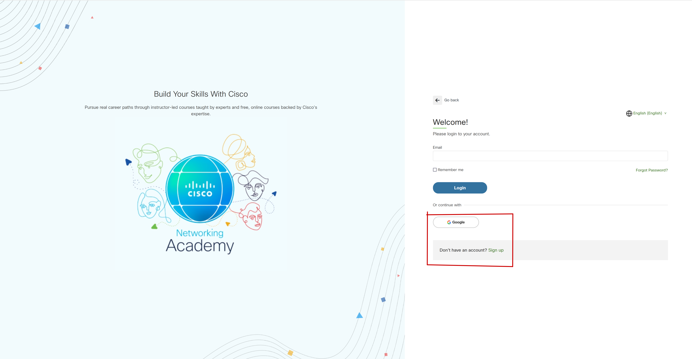
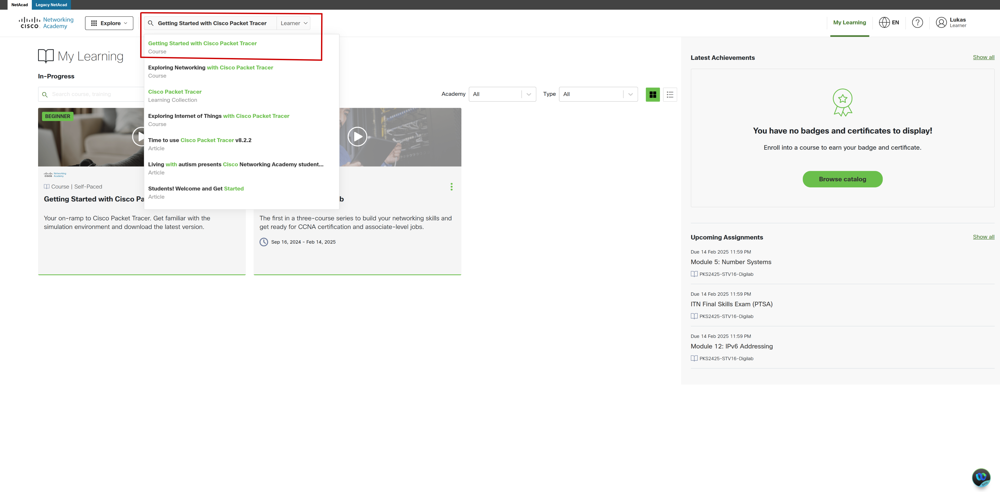
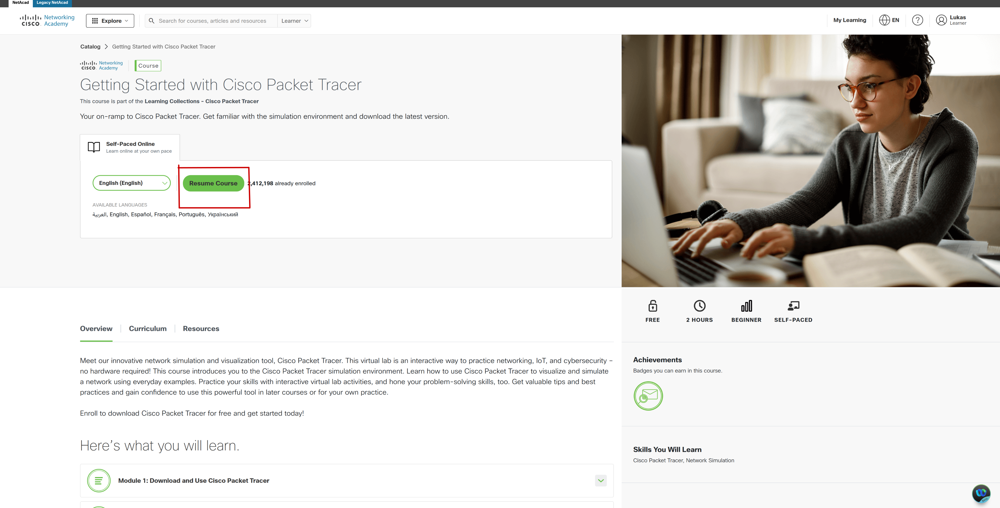
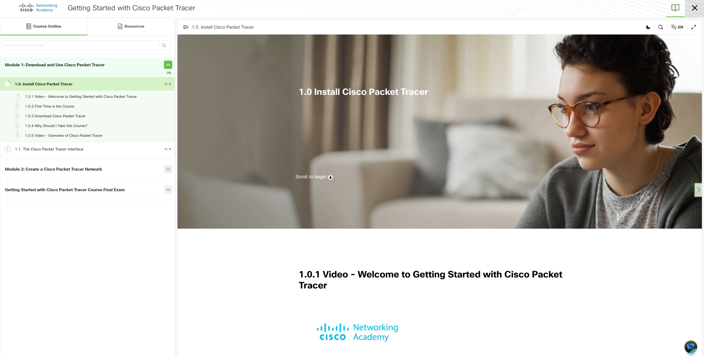

# Požiadavky na 1. cvičenie

Nasledujúce úlohy je potrebné splniť pred prvým cvičením a prísť na cvičenie už s nainštalovaným softvérom.

## Inštalácia Packet Tracer (PT)

Packet Tracer je sieťový simulátor od spoločnosti Cisco, ktorý umožňuje vytvárať kompletné sieťové topológie a analyzovať ich správanie. Je primárne určený na výučbu sieťových technológií. Pokyny na inštaláciu a zoznámenie sa s PT:

1. Zaregistrujte sa a prihláste do Cisco Network Academy cez odkaz pre vaše konkrétne cvičenie, ktorý nájdete v [súbore](https://is.stuba.sk/auth/dok_server/slozka.pl?id=265368;download=266105;lang=sk) v AISe na dokumentovom serveri pre tento kurz (Dokumentový server->Fakulta informatiky a informačných technológií->Predmety->ZS 2024/2025->PKS_B Počítačové a komunikačné siete->Cvičenia->Netacad pozvánka). Každý študent bude zaradený do triedy, kde bude mať prístup k materiálom pre tento predmet.
2. Po kliknutí na vyššie uvedený odkaz sa otvorí okno s kurzom pre vaše cvičenie. Kliknite na _Get Started_ a budete presmerovaní na stránku, kde sa môžete zaregistrovať vytvorením nového účtu alebo prihlásením sa cez svoj existujúci Google účet.
   
   
3. Následne pomocou vyhľadávača nájdite kurz **_Getting Started with Cisco Packet Tracer_** a otvorte ho.

   
   
   

4. Prejdite si modul 1 _Download and Use Packet Tracer_, ktorý vás prevedie postupom, ako si nainštalovať PT.

   

5. Po úspešnej inštalácii PT si prejdete modul 2, kde sa oboznámite s prostredím PT.

## Inštalácia Wireshark (WS)

Wireshark (WS) je nástroj na analýzu sieťových protokolov. Zachytáva pakety zo sieťového rozhrania a poskytuje podrobné informácie o každom pakete. Nástroj si stiahnite na tomto [odkaze](https://www.wireshark.org/download.html) a nainštalujte ho. Na stránke tiež nájdete [dokumentáciu](https://www.wireshark.org/docs/wsug_html/).

Veľmi podrobný manuál k analýze paketov pomocou WS nájdete aj v [materiáloch.](<../../materials/Network%20Analysis%20Using%20Wireshark%202%20Cookbook%20Practical%20Recipes%20(2018).pdf>). Zároveň tam nájdete ťahák na vytváranie [filtrov](../../materials/Wireshark-Cheat-Sheet.pdf), ktorý bude pre vás veľmi užitočným pomocníkom počas tohto kurzu.
